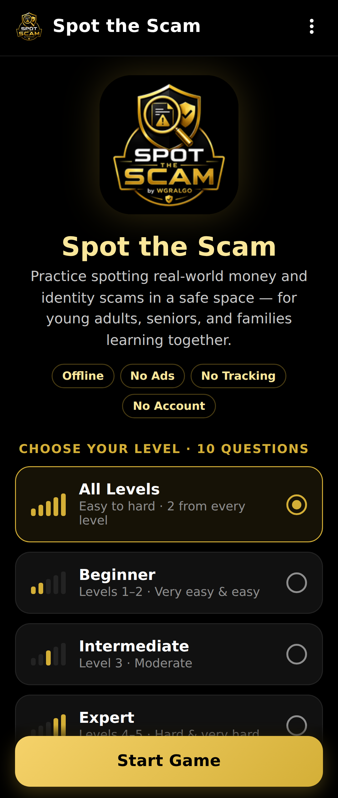
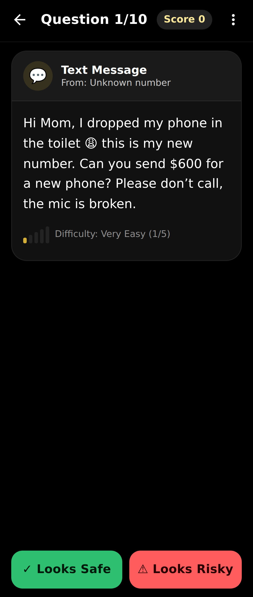
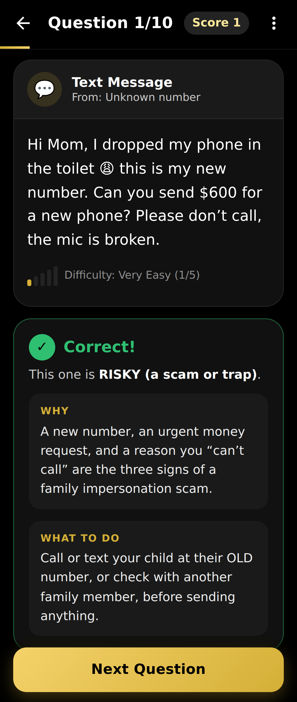
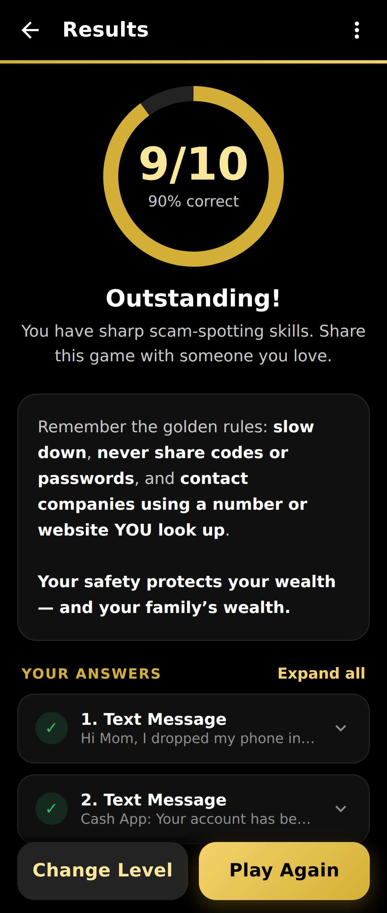
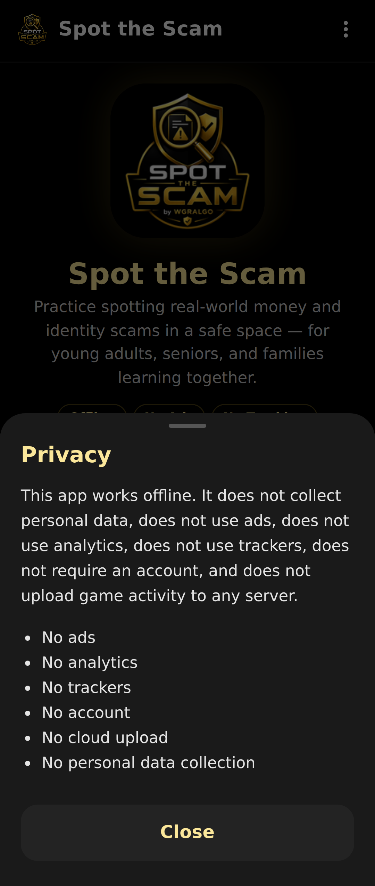

# Spot the Scam

**Version: 1.0.4**


A free offline Android scam-awareness game from **WGRALGO / The Wealth Gap Resolution Algorithm™ Inc.**

Spot the Scam was created as a free educational scam-awareness tool for young
adults, seniors, families, serious people with limited resources, and serious
people who do not support corporate greed. The app exists to help people
practice recognizing real-world scam patterns without ads, tracking,
subscriptions, paywalls, or data collection.

It covers common red flags in scams involving money, identity, jobs, banking,
charity, delivery messages, fake prizes, tech support, and urgent payment
demands.

---

## Features

- 100 real-life scam/safe scenarios (texts, emails, calls, letters, apps,
  websites, social media, in person), 10 safe + 10 risky at each of 5 levels
- Choose your level: All Levels, Beginner, Intermediate, or Expert
- 10-question randomized rounds, balanced and ordered easy to hard
- Instant feedback after each answer, with **Why** and **What to do**
- End-of-round score ring and expandable review of every question
- Native-style app design: app bar, progress bar, bottom action buttons
- Offline-first
- No ads
- No analytics
- No trackers
- No account
- No cloud upload
- No in-app purchases

---

## Screenshots

Captured from v1.0.4 at Android phone size (360dp wide, 1080×2547 PNG).

| Start | Question | Feedback |
|-------|----------|----------|
|  |  |  |

| Results | Privacy |
|---------|---------|
|  |  |

---

## Install / Sideload

1. Download `SpotTheScam-v1.0.4.apk` from the
   [GitHub Releases](../../releases) page (tag `v1.0.4`).
   **If you have v1.0.3 or older installed, uninstall it first.** v1.0.4 is
   signed with a new release key, so it cannot install over older versions.
2. On your Android device, allow installation from your browser/file manager
   ("Install unknown apps").
3. Open the downloaded APK and tap **Install**.
4. Launch **Spot the Scam**.

No account, sign-in, or network connection is required.

---

## Verify Download

Each release attaches a `.sha256` file next to the APK. Download both, then:

```bash
sha256sum -c SpotTheScam-v1.0.4.apk.sha256
```

Release signing certificate (CN=WGRALGO), SHA-256 fingerprint from v1.0.4 onward:

`F1:4B:A2:5D:6D:F1:32:BD:A5:47:A3:D2:C6:3B:11:3B:E7:5B:97:C8:43:D9:57:70:6B:9E:3E:0E:29:B9:27:45`

Check it with `apksigner verify --print-certs SpotTheScam-v1.0.4.apk`.

---

## Build from source

Requirements: JDK 17, Android SDK (build-tools 35.0.0), Node.js 20+.

```bash
npm install
npm run build:release
```

Or step by step:

```bash
npm install
npx cap sync android
cd android
./gradlew assembleRelease
```

### Release signing (secrets stay out of git)

The build reads signing material from a `keystore.properties` file in the
`android/` folder **or** from environment variables. Neither the keystore nor
its passwords are committed.

Option A — `android/keystore.properties` (git-ignored):

```properties
storeFile=/absolute/path/to/spotthescam-release.keystore
storePassword=********
keyAlias=spotthescam
keyPassword=********
```

Option B — environment variables:

```bash
export STS_KEYSTORE_FILE=/absolute/path/to/spotthescam-release.keystore
export STS_KEYSTORE_PASSWORD=********
export STS_KEY_ALIAS=spotthescam
export STS_KEY_PASSWORD=********
```

Generate a keystore (once, kept private and off git):

```bash
keytool -genkeypair -v -keystore spotthescam-release.keystore \
  -alias spotthescam -keyalg RSA -keysize 2048 -validity 10000
```

### Publishing a release from GitHub

The **Android Signed Release** workflow (`.github/workflows/release.yml`)
builds, signs, validates, and publishes the APK to GitHub Releases. It reads
the keystore from repository secrets (Settings → Secrets and variables →
Actions): `STS_KEYSTORE_BASE64` (the keystore, base64-encoded),
`STS_KEYSTORE_PASSWORD`, `STS_KEY_ALIAS`, and `STS_KEY_PASSWORD`. Bump the
version in `package.json`, `android/app/build.gradle`, and
`tools/validate-release.sh`, add `release-notes/v<version>.md`, then run the
workflow from the Actions tab.

If no signing config is supplied, Gradle produces an **unsigned** release APK
(`app-release-unsigned.apk`). It will not install until signed manually with
`apksigner`. Use a debug or signed release build for distribution.

---

## Privacy summary

This app works offline. It does not collect personal data, does not use ads,
analytics, or trackers, does not require an account, and does not upload game
activity to any server. The `INTERNET` permission is **not** declared. See
[PRIVACY.md](PRIVACY.md).

---

## Contributors

- **WGRALGO** — Project owner, creator, maintainer, content direction, testing,
  and public-benefit mission.
- **ChatGPT** — Assisted with the original HTML/web game code used for the
  website version.
- **Claude** — Assisted with building the Android APK implementation.

This project is owned and maintained by WGRALGO. AI tools are credited for
development assistance and do not hold ownership of the project. See
[CONTRIBUTORS.md](CONTRIBUTORS.md).

---

## License

**GNU General Public License v3.0.** Copyright © WGRALGO / The Wealth Gap
Resolution Algorithm™ Inc. See [LICENSE](LICENSE).

Spot the Scam is licensed under the GNU General Public License v3.0 so the app
can remain free, open-source, and available for public education. Anyone may
use, study, modify, and share it, but distributed versions must preserve the
same open-source freedoms under GPLv3.

---

## Contact

wealthgapresolutionalgorithm@gmail.com
